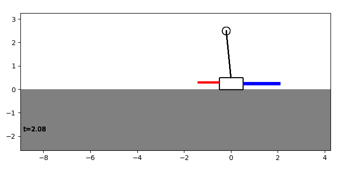
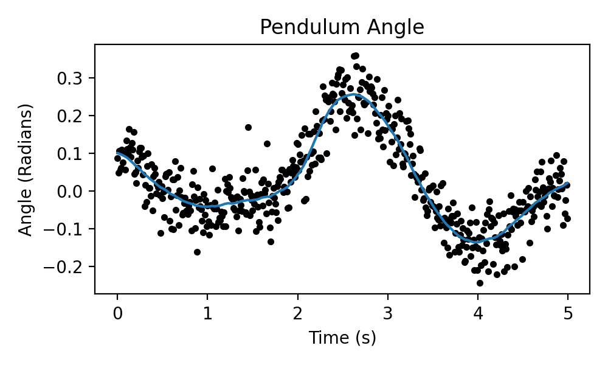

Summary
=======

This package is a companion tool for exploring dynamics, control, and machine learning for the canonical cart-and-pendulum system. It includes a software simulation of the cart-and-pendulum system, a visualizer tool to create animations of the simulated system, and sample implementations for controllers and state estimators. The package, written in Python, can be used on any platform, including in the browser. It gives the user a plug-and-play sandbox to design and analyze controllers for the inverted pendulum, and is compatible with Python's rich landscape of third-party scientific programming and machine learning libraries.

The package is useful for a wide range of curricula, from introductory mechanics to graduate-level control theory. The inverted pendulum is a canonical example in control theory (See, e.g. `@Astrom:2008`). A set of example notebooks is provided as a starting point for this range of topics.

Statement of need
=================

Curricula in the study of dynamical systems and control can be quite abstract. The effects of changing system, control, or modeling parameters are difficult to grasp when a student only examines the abstract mathematical model of a system. Because of this, direct experimentation is a natural way to better understand how these systems evolve over time given different controllers and parameters.

Physical laboratory setups are expensive, time-consuming, and can only be used by a handful of students at a time. Virtual experiments have none of these downsides and can be used to augment course content, even for remote-only instruction. The virtual platform allows students to easily share their work, run experiments collaboratively or individually, and develop controllers or investigate system dynamics in a fast design-test loop. 

Instructors can design experiments in `pendsim`, and subsequently measure any system parameter or variable, including the animation of the system. The package includes visualizations and pre-built controllers. It is a capable companion to any control or dynamical systems course material, in either a virtual, hybrid, or in-person context. 


Example Usage
=============

The software is a virtual laboratory. Users create an experiment by specifying a set of parameters: the pendulum (mass, length, friction, and so on), the simulation parameters (such as external forces). A controller policy designed by the user can then be applied to the system in the simulation. Finally, the user can view the results of the simulation. The ability to rapidly create and run experiments allows for fast design-test loops.

This simple example shows the ease of creating, modeling, and visualizing a proportional-integral-derivative controller:

```python
# define simulation parameters
dt, t_final = 0.01, 5.0
def forcing_func(t):
    return 10 * np.exp(-(((t - 2.0) / 0.2) ** 2))

# define pendulum parameters
pend = sim.Pendulum(
    2.0,  # Large mass, 2.0 kg
    1.0,  # Small mass, 1.0 kg
    2.0,  # length of arm, 2.0 meter
    # state inputs are stored as numpy arrays:
    # [x, xdot, theta, thetadot]
    initial_state=np.array([0.0, 0.0, 0.1, 0.0]),
)

# PID gains
kp, ki, kd = 50.0, 0.0, 5.0
# controllers are stored in the controller module.
cont = controller.PID((kp, ki, kd))

# create simulation object
simu = sim.Simulation(
    # timestep, simulation time, and forcing function
    dt, t_final, forcing_func, 
    # simulate gaussian noise added to state measurements
    noise_scale=np.array([0.05, 0.05, 0.05, 0.05])
)

# run simulation with controller and pendulum objects
results = simu.simulate(pend, cont)

# create an animation of the results
visu = viz.Visualizer(results, pend)
ani = visu.animate()
```



Rich plots of any system attribute are easy to generate:
```python
import matplotlib.pyplot as plt
fig, ax = plt.subplots()

ax.plot(results[("state", "t")])
ax.scatter(
  results.index, results[("measured state", "t")].values,
  color="black", marker=".",
  )
ax.set_ylabel("Angle (Radians)")
ax.set_xlabel("Time (s)")
ax.set_title("Pendulum Angle")
plt.show()
```



Package Features
================

A core pendulum/simulation module. (`sim.py`)
---------------------------------------------

This simulates the system dynamics and allows for external forces on the pendulum. Users can specify:

-   pendulum parameters (e.g., masses, length, friction, etc.)

-   a time period over which to simulate

-   an external forcing function (e.g., push)

-   noise characteristics

-   a timestep for the simulation

-   a controller to use, if any

Controllers, Estimators, etc. (`controller.py`)
-----------------------------------------------

Several controller implementations are pre-built. These include:

-   Bang Bang (On-Off) controller

-   Proportional-Integral-Derivative (PID) controller

-   Linear Quadratic Regulator (LQR) controller

-   State estimation using an Unscented Kalman Filter (UKF) is implemented (with package `filterpy` [@labbe:2021] )

Additionally, any control policy can be implemented by the user, by creating a new class. This allows for open-ended controller design. Controllers can dump data into the simulation results so that intermediate control inputs are accessible to the final results of the simulation.

Visualization (`viz.py`):
-------------------------

Finally, the results of a simulation can be visualized. The 'matplotlib' backend is used to draw an animation of the inverted pendulum and any plots from the simulation. The visualization uses the results of the simulation to draw the inverted pendulum, including the external and control forces applied to it. The animation module allows for the system to plot real-time simulation data (e.g., data used by the controller) side by side with the animation.

The results of the simulation, stored in datastructures defined by the package `pandas`, are easy to query and plot with `matplotlib`. This makes generating sophisticated plots of simulation attributes easy.

Example Notebooks:
------------------

The repository includes several notebooks which show the capabilities of the package. Notebooks hosted on Google Colab are linked here:

-   [Animated Plots](https://colab.research.google.com/github/rland93/pendsim/blob/master/notebooks/tutorial_plot_inline.ipynb)

-   [System Linearization](https://colab.research.google.com/github/rland93/pendsim/blob/master/notebooks/linearization.ipynb)

-   [PID Tuning](https://colab.research.google.com/github/rland93/pendsim/blob/master/notebooks/PID.ipynb)

-   [Applying a state estimator for better control](https://colab.research.google.com/github/rland93/pendsim/blob/master/notebooks/state_estimation.ipynb)